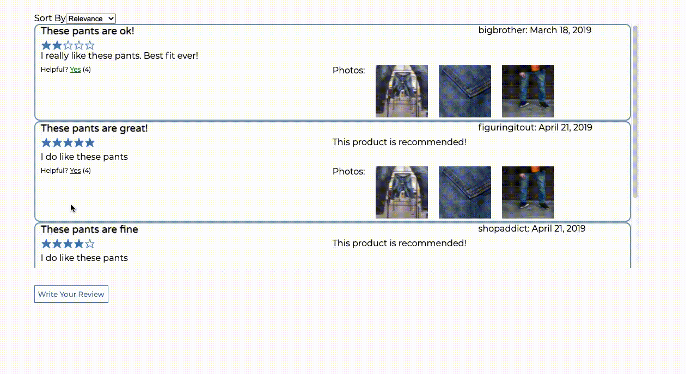
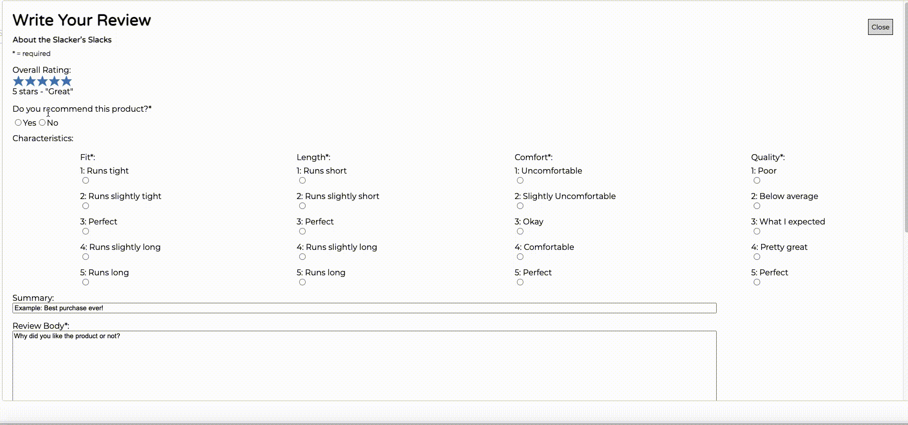

# The Backers
## Front End Capstone Project

A three person dev team created a mock product page for an e-retail site focusing on the front-end using advanced frameworks. React and Redux were the primary libraries used. This project was built in two weeks using guidelines from a mock buisness requirements document. The given data supplied to the team came from a blackbox API.

> 

## Table of Contents

1. [Installing Dependencies](#Installing-Dependencies)
2. [Requirements](#Requirements)
3. [Technologies Used](#Technologies-Used)
4. [Accessibility and Performance](#Accessibility-and-Performance)
5. [Components](#Components)

## Installing-Dependencies

> Navigate to the root directory and run the following scripts to run locally.

- `npm install` - install dependencies
- `npm run react-dev` - webpack build the front end
- `npm start` - start the server
- `npm test` - runs our jest tests

* Navigate to http://localhost:3000/

## Requirements

Ensure that the following modules are installed before running `npm install`

- Node v14.00.0 or higher

## Technologies-Used

> Front-End: Worked with advanced frameworks to create an intuitive UX.

- [React](https://reactjs.org/)
- [Redux](https://redux.js.org/)

> Back-End: Implemented a security-oriented server by intercepting all API requests in order to protect our private information.

- [Node.js](https://nodejs.org/en/)
- [Express](https://expressjs.com)

> Testing Suite: Created modular tests along with an example test suite to faciliate code coverage.

- [Enzyme](https://enzymejs.github.io/enzyme/)
- [Jest](https://jestjs.io/docs/en/api)

## Accessibility-and-Performance

Our application reaches __100% accessibility__ and has high performance levels.
A few metrics:

- The business requirements demanded a Time to First Paint of 0.8 seconds
	- We achieved this in 0.7 seconds
- The requested Time to Interactive was 2.5 seconds
	- Our application's came down to 2.2. seconds

# Components

Each team member was in charge of a component on the app. Anton Menchaca worked on the Product Overview, Nastassia Fulconis focused on the Related Items and the Outfits, and David Backer was in charge of the Reviews.

---
## Product Overview Documentation
---
### Intro
This widget was built using the business requirements documented as well as the design mockup provided. All of the components were built from scratch using react and css styling.

---

### Product Overview Breakdown
This section, following the business requirements, displays:

- A gallery of photos for the current Product given by the API. This gallery features:
	- image of the default style for the product chosen
	- carousel feature for associated photos of current style chosen
	- expand and zoom feature for the current product chosen.
	- enables user to choose specific style
- A detailed product description:
	- detailed product information (product name, category, and price, description, features, rating)
	- enables a user to add current product to outfits list with a click event on the heart button
	- add to bag feature which specifies the current available quantity and sizes
	- share feature that allows the current product to be shared through social media

> 

---

## Related Items Documentation
---
### Intro
This widget was built using the business requirements documented as well as the design mockup provided. All of the components were built from scratch using react and css styling.

---

### Related Items Breakdown
This section, following the business requirements, displays:

- a carousel of related products as given by the API. Each product card shows:
	- the product image
	- basic product information (product name, category, and price)
	- the product rating, as shown by the average number of stars received
- an outfits carousel, with each item displayed in product cards (described above). The outfits list:
	- enables a user to add the current product to their outfits list
	- enables a user to remove any product from their outfits list
	- is user specific. I implemented redux-persist in order to retain inputed data

> 

---

## Reviews Documentation
---
### Intro
This component was built using the business requirements document as well as the design mockup provided. All of the components were built from scratch using react and css styling.

This section uses mostly react class components to store local states that affect a components content and styles. Eventually, these class components will be refactored out in favor of more redux containers and functional components utilizing react hooks.

---

### Reviews Breakdown
As per the business requirements doc, this section takes the meta data for a product's reviews and displays the...

- overall average rating
- % of users that recommended the product
- number of reviews for each rating
- consumer feedback on a product's qualities (if applicable)

This section can also filter the reviews list based on the star ratings selected here.

### Reviews List
The business requirements doc requested that the reviews list display a...

- default of two reviews loaded on the list
- dropdown menu that gives different sort options
- "more reviews" button that loads up to two more reviews
- "write a review" button that opens the window to write a new review

This list is composed of review entries that each include a...

- star rating
- summary for the review
- nickname for the user who posted the review
- main review body
- date for when the review was posted
- indication that the user recommended the product
- button to mark the review as 'helpful'
- photos posted by the user to include in the review (if applicable)
- response to the review by the seller (if applicable)

### Add Review Form
This form follows the business requirements doc's guidelines, allowing users to input a...

- Overall rating of the product (required)
- Rating for each characteristic applicable to the product (required)
- Summary of their thoughts (maximum of 60 characters)
- Main review body (required, minimum of 50 characters, maximum of 1000 characters)
	- Indicator of how many more characters are needed to reach the character minimum
- Photos related to the review
- Nickname (required, maximum of 60 characters)
- Email address (required, maximum of 60 characters)
- Submit button

